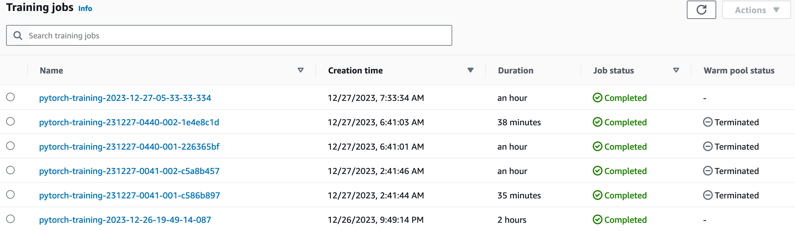
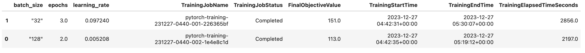
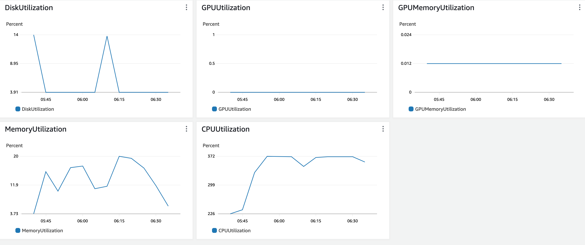
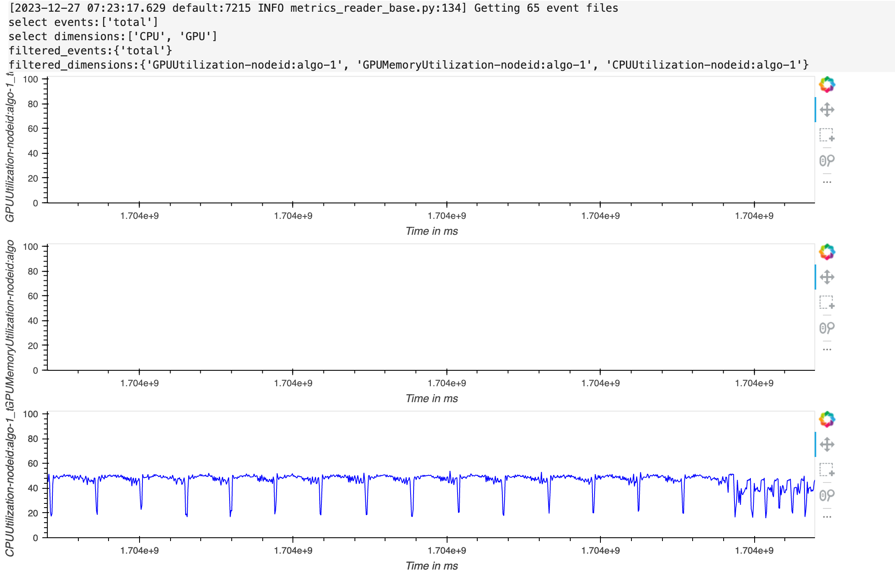
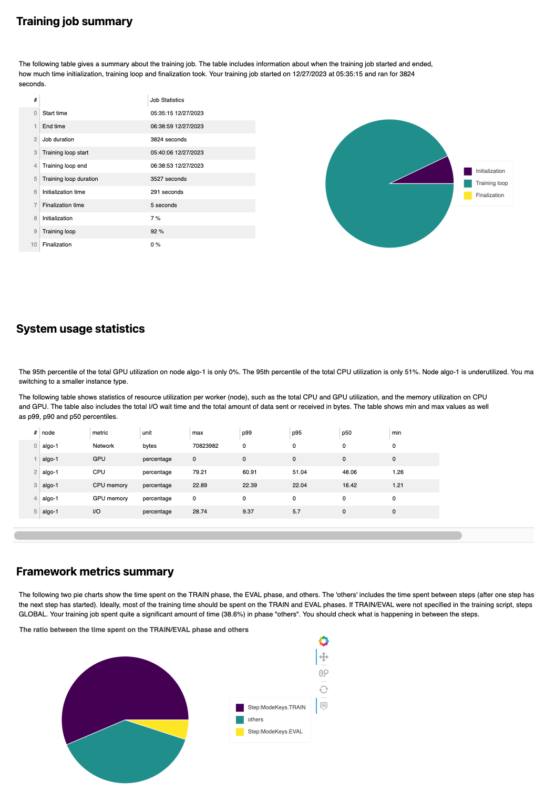

# Dogbreed ResNet50
A dogbreed machine learning project, using pre-trained restnet50 model

## Overview
Use AWS Sagemaker to train a pretrained model that can perform image classification by using the Sagemaker profiling, debugger, hyperparameter tuning and other good ML engineering practices. This can be done on either the provided dog breed classication data set or one of your choice.

The structure of this notebook:
    
    1. Project Set Up and Installation
    2. Dataset
    3. Hyperparameter Tuning
    4. Debugging and Profiling
    5. Model Deployment

## 1. Project Set Up and Installation
Enter AWS through the gateway in the course and open SageMaker Studio. 
Download the starter files.
Download/Make the dataset available. 

## 2. Dataset
The provided dataset is the dogbreed classification dataset which can be found in the classroom.
The project is designed to be dataset independent so if there is a dataset that is more interesting or relevant to your work, you are welcome to use it to complete the project.

### Access
Upload the data to an S3 bucket through the AWS Gateway so that SageMaker has access to the data. 

## 3. Hyperparameter Tuning
What kind of model did you choose for this experiment and why? Give an overview of the types of parameters and their ranges used for the hyperparameter search

Remember that your README should:
- Include a screenshot of completed training jobs

  **Completed training jobs**
  
  
  
- Logs metrics during the training process

  **Tuner Job Analytics**
  
  
  
- Tune at least two hyperparameters

    Three hyperparameters were included in our scope, namely: batch_size, epochs, and learning_rate

- Retrieve the best best hyperparameters from all your training jobs

    {'_tuning_objective_metric': '"Test Loss"','batch_size': '"128"','epochs': '2','learning_rate': '0.005207906609165008','sagemaker_container_log_level': '20','sagemaker_estimator_class_name': '"PyTorch"','sagemaker_estimator_module': '"sagemaker.pytorch.estimator"','sagemaker_job_name': '"pytorch-training-2023-12-27-04-40-56-927"','sagemaker_program': '"hpo.py"','sagemaker_region': '"us-east-1"','sagemaker_submit_directory': '"s3://sagemaker-us-east-1-263262376552/pytorch-training-2023-12-27-04-40-56-927/source/sourcedir.tar.gz"'}

## 4. Debugging and Profiling
With model debugging, we can check how well our model training is happening. Model profiling helps to see how well we are using our instance resources like the CPU and GPU Memory.
By specifying the following rules:

    - loss_not_decreasing: checks if loss is decreasing and triggers if the loss has not decreased by a certain persentage in the last few iterations
    - LowGPUUtilization: checks if GPU is under-utilizated
    - ProfilerReport: runs the entire set of performance rules and create a final output report with further insights and recommendations.
    - VanishingGradient
    - Overfit
    - Overtraining
    - PoorWeightInitialization

The debug configuration will capture system metrics at 500 milliseconds. The system metrics include utilization per CPU, GPU, memory utilization per CPU, GPU as well I/O and network.
Debugger will capture detailed profiling information from step 1 to step 10. This information includes Horovod metrics, dataloading, preprocessing, operators running on CPU and GPU.

### Results

  **Profile+Debug Taining Job Chart**
  
  

  **Timeline Charts**
  
  

  **Profiling Charts**
  
  

  
  You can check the full profiler report on the main notebook or you can click [here](./ProfilerReport/profiler-output/profiler-report.html)

## 5. Model Deployment
**TODO**: Give an overview of the deployed model and instructions on how to query the endpoint with a sample input.

**TODO** Remember to provide a screenshot of the deployed active endpoint in Sagemaker.

## Standout Suggestions
**TODO (Optional):** This is where you can provide information about any standout suggestions that you have attempted.
